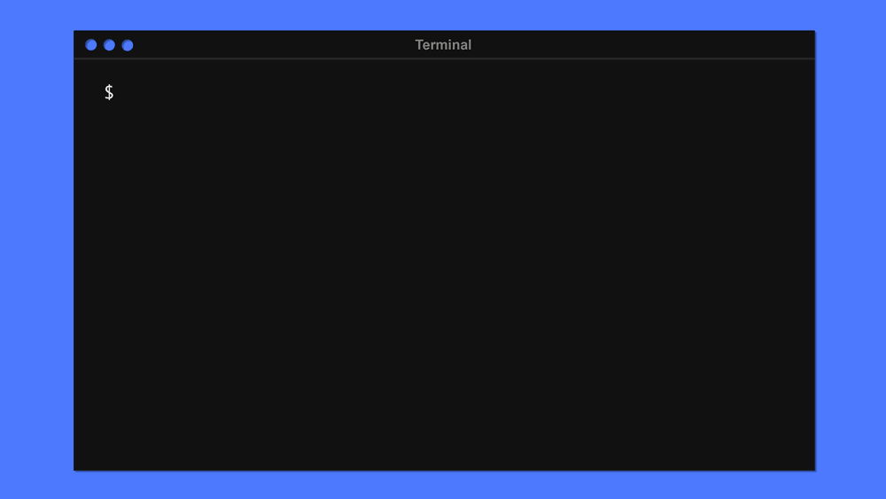

<img style="max-width: 50px;display: inline-block;vertical-align: middle;" src="data:image/png;base64,iVBORw0KGgoAAAANSUhEUgAAAIAAAACACAYAAADDPmHLAAAPCklEQVR4Xu2de3hcxXnG32/OyoBjSMC62ASCQwK2sa3dNS5pgCQtSUNwfNmViKi5JE1SaNM/+rQ0oUmapk5zAwdISEuojbG5GGMUpJUccwuhwXHSQBHSrgwtUGOHWrKobAu0q4ulPTPTZ9aICCN5tdLMObPas8+jv8453/d+7/w05+zMnFlC8ClpB6ikqw+KRwBAiUMQABAAUOIOlHj5QQ8QAFDiDpR4+UEPEABQ4g6UePlBDxAAUOIOlHj5QQ8QAFDiDpR4+UEPEABQ4g6UePlBDxAAUOIOlHj5QQ8QAFBCDkhJ2P7SLAwNnIiT2AwMlnHM5EMYcPpRt2i4hJx4q9Tp1wOoRm7YPd9hMkJMhjnHOcT42QR6LwQ7DQyhMRta8AwYOyggf8ck7ZXEnmcQKfeEoVYs/8P0dIVjegCwPfV+JsRlUuBSRrgIoNn6GkwICZli0nkKTDzizjh5F5afM6Qvvr+RiheA5tbTGaerQGINwYl6ZqNEGhKNRHKr2x55EmtJeJbbQKLiAkBKCjUlP8Yl/TUjrALgGPBk4iGF2Ccdtl6E2AasqH594hfac2ZxACAlOYnkKhD7BiCX2WPfiBLRR2DrXUnrUBPutk/f+IqsByDUlPqIlPJmABdYb6wQ/cTYre5MugmXhvut1wtYvCy8oWWuw5xbAFpTDEa+XaPogKTreTzyEIikzfrt6wFUd9/cfg04/xEYO9Vm8/JpEwJNEu5foXZZV75z/TpuFwA72k+lYb6BEV3ulyHa8wocAuHzvCayQ3tsDQGtAaCsORkVAgkAZ2moy7oQJLDO5S9/HXV13CZxVgDgJJJ1AO4GcJJN5ujWIoCfy6xbh7plvbpjTzaevwBISawpdT0B6im/JD6Si92CnOWoDXfYULB/AKhBnUTyO5Lo6zYY4bGGV7lgl6C2eq/Hed+Rzh8AVOM3pm6UDDf4bYBv+SU6OTkfQ3zJK75p8GscgCWS/0jAP/tZuBW5BX7HZ+BirIx0+qXH8x7AaWy7FkQb/CrYtrwS/HlxQvYiv6acPQUglEh9XAr52Lhz8ra1jkd6BOExOfzyCj++InoHQEPrWQ5DK8BO88jXokpDUn7PrYn+g9eivQFgfUuZUxn6dVFM6HjdAqPzkfw0j0Uf8VKCJwCEEslvS+AbXhZWnLlEN5fOEi+nlI0DUJZIXiAgfgswVpyN4q1qAdEo40trvcpqFoD1LWWswmkhomqvCpoWeaSM8Zposxe1GAWANSavJ8ItXhQyvXKIDh4S87Fy2YDpuswB8LOWcscN7QHwbtNFTMf4EvimiEe+bbo2YwCEGpO3SsLfmiigYoaDg8NWzarqL1OIfs7xftQtPag/+O8jmgFALedyQnshcaIJ8Q3RuZjlEO7qSGP7wX4c4Vavupq0BUT0AzcWNjpfYgSAUFNqnZTyK5OuPM+FD0Xm4uOzjy4d6MlybDmQwd2daewbdE2l9CeuwADnZWeiblGPKQH6Aah/YZZTllVz3cbu/T+NzMUn3gRgtDH/3jOY6xV+fmgArpwevYIkfFXEIjcVDQCsMfmXRLjDlGAVtz4yB38ye+a4KTqPuLj3QCb399pQsfcKooNn98wzNU+gvQdwEskWAOf7CcBIbtULPHxwAJs609jVM4ji7RPYch6vftSEp1oBmNHUvoRL0W5C6OiYD4bn4JPl4/cAY+X/n4EsNnek8UBXBm+4Rfc6Xz2PR64w4atWALwa898WnoNLCwRgxDz1jaGxuw8bO9JoSxfJS77qYXCGW2FiYEgzAKn/kpALTZA6OuYD4Tn41CQBGB0nlRnGpo5ePPRaHwaE5TcIiVpeE2nU7a0+ABJt8xzQPt0Cx4q3NTwHl2kAYCR22hXY9lofNnWk8VK/pRuFSLmR10Sv1e2vNgCcRPI6AOt1Cxwr3v3VVVhe8S4jqX7z+iA2dWaw42A/hq3qFUQHj0Xfp/tdQ50A3AfgaiOtckzQLdVV+LQhAEZSdQ9z3Hcgg3s609h/xI6vklyIeahd+qpOjzUC0LYHoA/oFDderPuqq7DCMAAjuVUn8MThgdwAkxpo4n4OMJG8iseiW3V6rAeARNt7HJBnO2Tcu6QKKyvN3AKOZ+7/HnFzQ85q6NmPySgCbnHjkS9bB0CoMXmxJOzSKex4se5ZUoVVPgAwoikrJLYfVL1CL55+44hnA0y5dwvjkUt1+qylB/B6rf/dS6qw2kcARjfAi/3DuYfGbQcyyHDDA0xC7Oe1S99nHQChxrbvevmO3+bFlYhVzdLpw5RjqXGE+q5MDobdGVMDTELwbnEi/mJZdsqC3wygpwdoSm6BxFW6ROWLs2lxJeKWATBa83PpodxDY1N3PwY19wrcobOxKqxtvEULAJRIPs6AT+ZrOF3H71pciRqLARip8/WswNauDDZ3pvHKgJ5/WgZ8KBuP/KcuL7UA4MUM4OiCiwWA0Zqf6lGzkhk8enCqaxX0zgxqASCU8GYOYMTQjYsqUTvHrmeAif5Hdg25uKczkxtkOjCZtQpEn+Gx8EMTzZfvPC0AOAnvBoFUQRsXV6G2yvtxgHxmFnJcDSg9eujoANOvXh/EhEedpbya10TvLyTX8c7VA0BDch8Y5ukSlS/OnYsrcXkRPAPkq6OfSzzQlcZtr/aiY6LDzUSf47HwvfliT/S4FgBCidaXJNi5E0061fM2LKrEZ4r0FqBqV2MHaj3Cg10Z9BW6olnSGl4T3jZVD0eu1wIASzy3m+As1iUqX5z1iypRV2QAqOVp27v7c13+b6cyekio4bGI2k5Py0cLAE6ibRdAF2tRNIEg/7aoElcUCQDqQU899OlaoEqQf+zGo09NwKYJnaIFAEqkmhjk6gll1HDSHYsq8aeWA7CzZzDXzT+meYm6Q6x6OFa9W4ONuRBaAHASbT8B6Eu6ROWL85PzKrBm7sn5TvP8uFpZtLWrD5s7e/Fyv56Bn2OL4HKoHDUfOqyrOC0AsETbDQQy9vLCscXefl4FrrQIgOczQ9jYmcFPuzJm1xYKnuE1S9+tc1WQFgCcRKoWkNoGJ/LR/a/nVeAqnwFQy8XUWL/q5lt6vZkSlkBKxCORfP4UclwLAGhOzXeEfLGQxFM5918WVuDq0/25BajlYWps36dFIVt4PHLNVLw79lo9ANTXO07ZuRmvNnv+8cIKXOMxAE8eVg91vXjisH/LwiTk34t4dJ19AKhfb2ps2wmij+oUN16s2xZW4LMeAKBm87Z0ZXB3Rxp7B8081BXiFxF91I2Fta680tMDAAg1Jb8vJb5aSEGTPdc0AMnMEO7cn0bCwHz+ZGuGgMv5wCmou3Bw0jHGuFAjAK2fkJI9oVPceLF+tKAcn3vvKVpT2f/KGO3k8fAfaS1a1zhATtTmfSc67+lVGxkY/9GHHy4ox59pAkBtKqFeD1Pf39VmE7Z+pMTXRE3kRt36tPUAShg1JBOMIaZb5LHxbl1Qjs9PAQD1FuDjhwZyD3W/7ClgKtZ0YceJ7zhYPLwq8oJuCVoBcJraroQkbXPV4xV7y/xyfOGMwm8Bh7Mc93Ye3U5GrfEvlg+B/tuNh88zoVcrAFDbwzhDr4Exo6s1bp5fji8WAMCzvUdwp9pQqrsfQxNeeWHC7snFNLllnF4A1NfBROtdAPvC5Eqd2FU/mD8bf37G8bcgGhy1TLvd2DLtiemd2llCcCqbh9iS/VOLM/bV2gE4ujcwnjEhdiTmunNn49ozxwZgz0A298bOA1196C2+nUDeYZuA3CHj0ZWm/NQOgBLqNCR/A4YLTYleN78c1466Baj1dY+oV7U60/hVUe8F9E7HiOESd3Xkl6a8NANAoi0GkLZVK8cWf9P8clx3xilQr3CrBzq12ELtDDb9PtTCY9UX6Jz9O9YjIwBgrWQsnGolIGyiUdRMoLrH27eJg+ZqhVzBa6MPa476tnBmAFC3gabUSki53aT4aR2b8DRfHb7Q5H+/8s8YAJCSqKntFwzskmndUIaKY4I+nK0NP20o/FthzQEAILdvIBetwa+EFdyM9/F45LMFXzWJC4wCoPR4OUs4ifotvET08CwWmN4mfqRw4wCg/j9OCs2Y2SolFljotn2SNL/6la9A8wAAKGtILRWQzwS3gjzNQdjGV4evNP3gN1qFJwCohCzR9jcE+mE+Ikv3uHyFA8sQj77hpQeeAaC+FThNKfVOW52XBRZFLsIRJuWHs/Fo0mu93gGgKns89S5nQO40vZ281yZOPR9dzuPhhqnHKTyCtwAofc2tpzsuU3MFnr1OXrgt3l0hib4iYuGbvcv49kzeA5CD4LkPOtLZBYk5fhVuQ14i3OjGIl/zU4s/AKiKG59b6JDzJIC5fhrgV26S8mY3HrnByyf+sWr1D4CRnkA4vwBwll8N4UdegvyWG4t8y+/GV7X7C4BS0NAylzF6mOBE/WgMj3NySPklXhO90+O846bzHwAlrf6FWRQa3syILrfFGP06RA8RrnBjS1WPZ83HDgCUHVISa27/O+Ly+9NwxPBZ7tAVOnf41EWQPQC8WVFZQ9sfSEb3S+AcXUX6F0cIIrbO/T/3mzr399VZj3UA5IpTE0jOzLWSiS8DjOks2KtYEvx5B84XdW7rakK7nQC8WalaT5AV4seMoP2dOBNm5mJKpCXJfxLd/HZb/+tH1241AEcNleQ0t6+QQnyHiKqNNdxUAxOOkMTtblbc5NVc/lQlq+vtB2CkyrWSOdXJlZB0g8kl5wWbKpEm4A5XurehdllXwdf7fEHxADDKqLJE+/lCiOsAvgbM8WevGOBZEG3gw6FtqFvU53M7Tjp9UQLwVrXqlfRTey8DUAspPwXQ7Ek7ke9CISQc9owUcodwxINYff6efJcUw/HiBmC0w/X1TplzzlJO9BFJ4iIGigB09uQbQfQBzm4CnpHAr3kouxMrlx2afDw7r5w+AIzlb/OLJ5eJwQ8ISWdLojMZ5GxJOA1CngCiEyDAQRgiQp+QOERANznY57piL3ZH92MtGf4VKP+hmN4A+O+v9QoCAKxvIrMCAwDM+mt99AAA65vIrMAAALP+Wh89AMD6JjIrMADArL/WRw8AsL6JzAoMADDrr/XRAwCsbyKzAgMAzPprffQAAOubyKzAAACz/lofPQDA+iYyKzAAwKy/1kcPALC+icwK/H/Vi1jM9odi9wAAAABJRU5ErkJggg==">
<a style="display: inline-block;vertical-align: middle;font-size:25px" href="https://www.youtube.com/watch?v=DfRnJOZvtJg&amp;t=3s" target="_blank">Watch video</a>

### Framework : [squeezer.io](https://squeezer.io)
### Docs : [docs.squeezer.io](https://docs.squeezer.io)
### Chat : [chat.squeezer.io](http://chat.squeezer.io)

[](https://gitter.im/SqueezerIO/squeezer?utm_source=badge&utm_medium=badge&utm_campaign=pr-badge&utm_content=badge)




## What is Squeezer ?

Squeezer is a framework designed to help  developers to get a better architecture on serverless
zero-administration compute platforms where code runs on the top of
[microservices](https://en.wikipedia.org/wiki/Microservices) clouds like
[AWS Lambda](https://aws.amazon.com/documentation/lambda/) , [Azure Functions](https://azure.microsoft.com/en-us/services/functions/) , [IBM OpenWhisk](https://developer.ibm.com/openwhisk/) & [Google Functions](https://cloud.google.com/functions/)

## Features in short

- [Swagger UI](http://swagger.io/) API REST  support
- **SEO-friendly** web apps with the [PUG](https://pugjs.org/) support ( formerly known as **JADE** ) + your favorite JS framework + CDN integrated support for project's assets (js, images, css, ...)
- share components between microservices
- auto-deployable, auto-scalable , no DevOps requirements
- [CloudFormation](https://aws.amazon.com/cloudformation/) deployments , silent, 
no interruption for the current functionality ( really useful on production )
- [CloudDormation Nested Stacks](https://aws.amazon.com/blogs/devops/use-nested-stacks-to-create-reusable-templates-and-support-role-specialization/)
  support & use templates [Outputs](http://docs.aws.amazon.com/AWSCloudFormation/latest/UserGuide/outputs-section-structure.html) values directly as `process.env` variables  
- one single command to simultaneously deploy all available microservices on your project
- quick intuitive code deployments by using a special mechanism which will deploy only assets, functions and file packages
where code changed from the last deployment
- automatic rollback to the previous working deployment if something goes wrong
- sequential deployments, wait for the current deployments in progress to finish
- self-healing microservices
- test your code locally on a simulated microservices platform for a faster development cycle
- separate your environments in multiple stages
- extend framework functionality with your own "home-made" plugins
- pay only for the usage ( no monthly subscriptions )
- competitive pricing (  >= 2$ / 1 million HTTP requests on AWS API Gateway + Lambda )
- smart external dependencies inclusion into the compiled microservice ( **node_modules** and other project files ) ... just
like on any other trivial NodeJS project
- Babel ES6/ES7 + Webpack 2 integration

### Requirements

- [Install node.js](http://nodejs.org/) version `>=6`

## Squeezer CLI

> Squeezer command-line interface

### Templates

You can get various templates for creating a quick project stub :

| template | description  |
|-----|--------------|
|aws-api-nodejs|AWS generic API Hello World template
|aws-api-nodejs-rest|AWS NodeJS REST API template + DynamoDB + Swagger support
|aws-web-nodejs-reactjs|AWS NodeJS WebApp template + Pug ( ex-Jade ) + ReactJS support + Material UI + Bootstrap 3 styling


### Getting started

NOTE: **Windows** users should [enable symlinks](http://answers.perforce.com/articles/KB/3472/?q=enabling&l=en_US&fs=Search&pn=1) in order to avoid unwanted symbolic links errors .

#### Run

|    | cmd | description  |
|----|-----|--------------|
| 1. | **npm install -g squeezer-cli**  |  Install Squeezer CLI |
| 2. | [Configure AWS profile](https://docs.squeezer.io/clouds/aws/aws_profile.html)  |  AWS Profile |
| 3. | **sqz create --project my-first-project --template aws-api-nodejs --email you@example.org**  |  Create a project |
| 4. | **cd my-first-project**  |  Switch to the project's directory |
| 5. | **sqz install**  |  Install all requirements |
| 5. | **sqz compile**  |  Compile microservices |
| 7. | **sqz serve**  |  Simulates project on your local microservices platform<br>*NOTE* : Live reload enabled by default |


`WebApp` : [http://localhost:4001/](http://localhost:4001/)

`Swagger UI` : [http://localhost:4001/swagger-ui](http://localhost:4001/swagger-ui)


#### Deploy

|    | cmd | description  |
|----|-----|--------------|
| 1. | **sqz compile --production**  |  Compile microservices |
| 2. | **sqz deploy**  | Deploy your app into the cloud provider<br>*Note*: initial deployments can take longer <= **40 mins** |


### Project Structure

```
.
├── cloudformation      CloudFormation nested custom YAML templates
├── lib                 Project's Library
├── microservices       Microservices Directory
│   └── microservice1
│   └── microservice2
├── node_modules        Node NPM packages
└── plugins             Project's plugins
```
