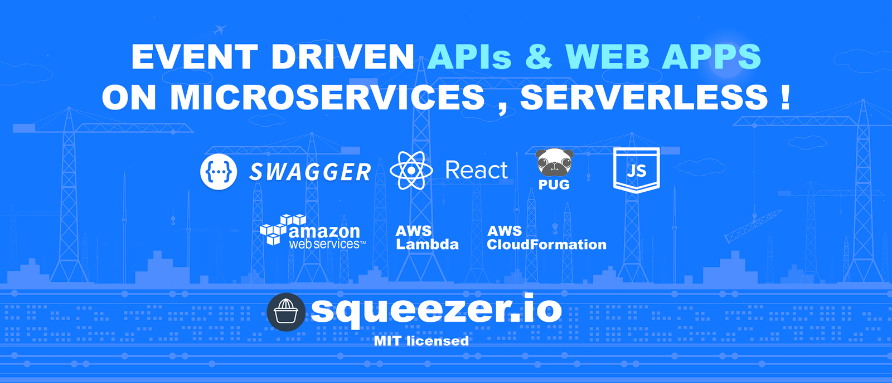

#### Framework : [squeezer.io](https://squeezer.io)
#### Docs : [squeezer.io/docs](https://squeezer.io/docs/)
#### Chat : [chat.squeezer.io](http://chat.squeezer.io)

### Contents

* [Getting Started](#getting-started)
* [Example Projects](#example-projects)
* [Features](#features)
* [Templates](#templates)
* [Plugins](#plugins)
* [Example Projects](#example-projects)
* [Contributing](#contributing)
* [Community](#community)

### What is Squeezer ?

Squeezer is a framework designed to help  developers to get a better architecture on serverless
zero-administration compute platforms where code runs on the top of
`functions` clouds like
[AWS Lambda](https://aws.amazon.com/documentation/lambda/) , [Azure Functions](https://azure.microsoft.com/en-us/services/functions/) , [IBM OpenWhisk](https://developer.ibm.com/openwhisk/) & [Google Functions](https://cloud.google.com/functions/)

### Features in short

- [Swagger UI](http://swagger.io/) API REST  documentation support
- **SEO-friendly** web apps
- share components between functions
- auto-deployable, auto-scalable , no DevOps requirements
- silent deployments ,no interruption for the current functionality ( really useful on production )
- access deployed resources credentials (DB user, pass ...) directly from `process.env` variables  
- one single command to simultaneously deploy all available functions on your project
- quick intuitive code deployments by using a special mechanism which will deploy only assets, functions and file packages
where code changed from the last deployment
- automatic rollback to the previous working deployment if something goes wrong
- sequential deployments, wait for the current deployments in progress to finish
- self-healing functions
- test your code locally on a simulated functions platform for a faster development cycle
- separate your environments in multiple stages
- extend framework functionality with your own "home-made" plugins
- pay only for the usage ( no monthly subscriptions )
- competitive pricing (  >= 2$ / 1 million HTTP requests )
- smart external dependencies inclusion into the compiled function ( **node_modules** and other project files ) ... just
like on any other trivial NodeJS project
- Webpack integration

#### Requirements

- [Install node.js](http://nodejs.org/) version `>=6`

### Squeezer CLI

> Squeezer command-line interface

#### Templates

Create a quick project stub by using templates :

| template | description |
|-----|--------------|
|aws-api-nodejs | AWS generic API app template. |
|aws-web-nodejs | AWS generic WEB app template. |
|azure-api-nodejs | Azure generic API app template. |
|azure-web-nodejs | Azure generic WEB app template. |

#### Plugins

Extend or merge the Squeezer framework functionality with plugins

| Plugin | Author |
|-----|--------------|
|**[AWS Plugin](https://github.com/SqueezerIO/squeezer-aws)**   This plugin enables AWS Lambda support within the Squeezer Framework. | [Nick Chisiu](https://github.com/nickchisiu) |
|**[Azure Plugin](https://github.com/SqueezerIO/squeezer-azure)**   This plugin enables Azure Functions support within the Squeezer Framework. | [Nick Chisiu](https://github.com/nickchisiu) |
|**[Serve Plugin](https://github.com/SqueezerIO/squeezer-serve)**   This plugin enables serving support for local development within the Squeezer Framework. | [Nick Chisiu](https://github.com/nickchisiu) |
|**[Swagger Plugin](https://github.com/SqueezerIO/squeezer-swagger)**   This plugin enables Swagger API Documentation support within the Squeezer Framework. | [Nick Chisiu](https://github.com/nickchisiu) |

#### Example Projects

| Project Name | Author | Demo |
|-------------|------|---------|
| **[AWS Generic API Project](https://github.com/SqueezerIO/example-projects/aws-api-nodejs)**   AWS generic API Hello World projects using Swagger API Docs | [Nick Chisiu](https://github.com/nickchisiu) | [demo](https://s3.amazonaws.com/awsapinodejs-dev-squeezerdeploymentbucket-249nnrc1a8l7/swagger-ui/index.html) |
| **[AWS Generic WEB Project](https://github.com/SqueezerIO/example-projects/aws-web-nodejs)**   AWS NodeJS WebApp template + ReactJS | [Nick Chisiu](https://github.com/nickchisiu) | [demo](https://s5j7ln2u4l.execute-api.us-east-1.amazonaws.com/dev) |
| **[AWS REST API Project](https://github.com/SqueezerIO/example-projects/aws-api-nodejs-rest)**   AWS NodeJS REST API template + DynamoDB + Swagger support | [Nick Chisiu](https://github.com/nickchisiu) | [demo](https://s3.amazonaws.com/awsapinodejsrest-dev-squeezerdeploymentbucket-fnurwkb8urep/swagger-ui/index.html) |
| **[Azure Generic API Project](https://github.com/SqueezerIO/example-projects/azure-api-nodejs)**   Azure generic API Hello World projects using Swagger API Docs | [Nick Chisiu](https://github.com/nickchisiu) | demo |
| **[Azure Generic WEB Project](https://github.com/SqueezerIO/example-projects/azure-web-nodejs)**   Azure NodeJS WebApp template + ReactJS | [Nick Chisiu](https://github.com/nickchisiu) | demo |
| **[Azure REST API Project](https://github.com/SqueezerIO/example-projects/azure-api-nodejs-rest)**   Azure NodeJS REST API template + Azure SQL + Swagger support | [Nick Chisiu](https://github.com/nickchisiu) | demo |

#### Getting started

NOTE: **Windows** users should [enable symlinks](http://answers.perforce.com/articles/KB/3472/?q=enabling&l=en_US&fs=Search&pn=1) in order to avoid unwanted symbolic links errors .

##### Serve

|    | cmd | description  |
|----|-----|--------------|
| 1. | **npm install -g squeezer-cli**  |  Install Squeezer CLI |
| 2. | **sqz create --project my-first-project --template aws-api-nodejs**  |  Create a project |
| 3. | **cd my-first-project**  |  Switch to the project's directory |
| 4. | **sqz compile**  |  Install packages & compile functions |
| 5. | **sqz serve**  |  Development mode **Live reload** enabled by default |

##### Deploy

|    | cmd | description  |
|----|-----|--------------|
| 1. | [Configure credentials](https://docs.squeezer.io/clouds/aws/credentials.html)  |  Cloud credentials |
| 2. | **sqz compile --cloud**  |  Compile functions for cloud deployments |
| 3. | **sqz deploy --stage dev**  | Deploy your app into the cloud provider *Note*: initial deployments can take longer <= **40 mins** |

#### Contributing

See [contributing.md](CONTRIBUTING.md) for contribution guidelines

### Community

* [Squeezer issues](https://github.com/SqueezerIO/squeezer/issues)
* [Gitter Chatroom](http://chat.squeezer.io/)
* [Facebook](https://www.facebook.com/Squeezer.IO/)
* [Twitter](https://twitter.com/SqueezerIO)
* [Contact Us](mailto:nick@squeezer.io)
