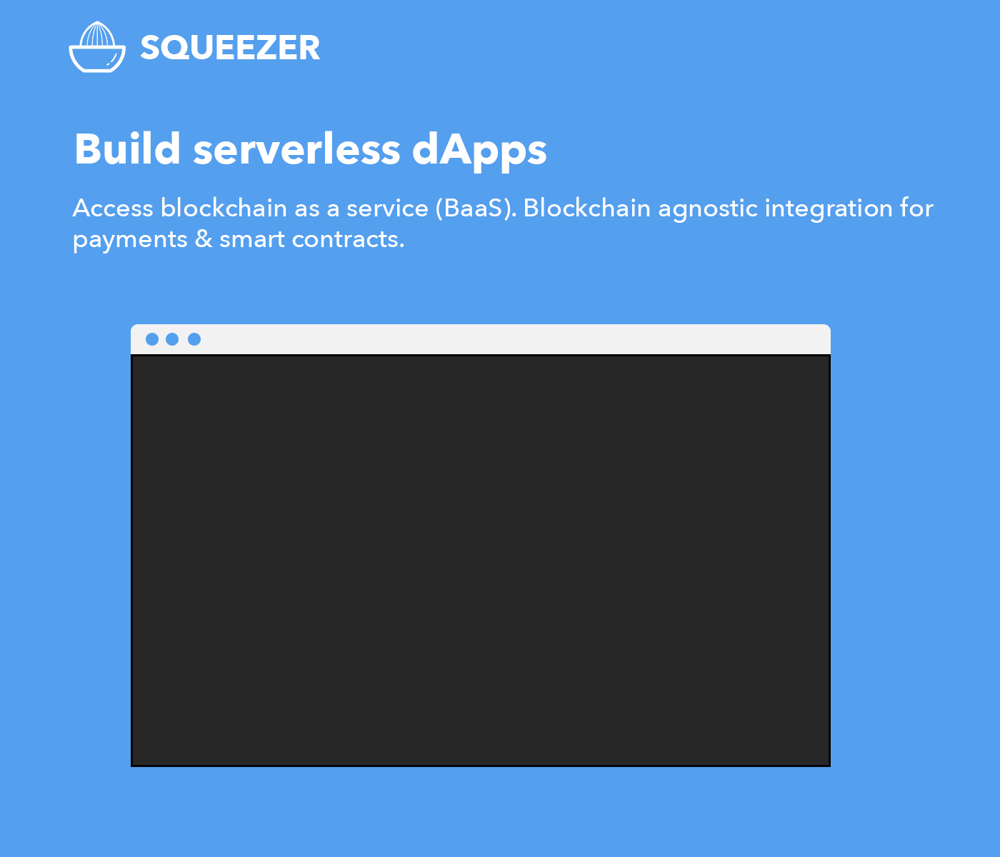

#### Framework : [squeezer.io](https://squeezer.io)
#### Docs : [docs.squeezer.io](https://docs.squeezer.io/)
#### Chat : [chat.squeezer.io](http://chat.squeezer.io)

### Contents

* [Getting Started](#getting-started)
* [Example Projects](#example-projects)
* [Features](#features)
* [Templates](#templates)
* [Plugins](#plugins)
* [Example Projects](#example-projects)
* [Contributing](#contributing)
* [Community](#community)
* [Meetups](#meetups)

### What is Squeezer ?

Squeezer is a platform that empowers new-entry blockchain developers to build serverless dApps simply as dead.

### ChainKit - Agnostic blockchain integration

The main usage of the ChainKit is to unify top blockchains interfaces into a single normalized API interface , therefore you can build blockchain dApps easily without digging into blockchain complex infrastructure.

[How to use the ChainKit](https://github.com/SqueezerIO/squeezer-chainkit)
### Features in short

- create blockchain wallets
- double-encrypt for wallet data
- user choose how to store wallet token
- bi-directional blockchain transactions (inbound and outbound)
- create blockchain payment solution
- build dApps connecting to smart contracts using chainkit agnostic connector
- deploy smart contracts
- quick intuitive code deployments by using a special mechanism which will deploy smart contracts and dApp services where code changed
- powered by microservices
- share components between functions, similar to monolytic project
- auto-deployable, auto-scalable , no DevOps requirements
- silent deployments ,no interruption for the current functionality ( really useful on production )
- one single command to simultaneously deploy all available functions on your project
where code changed from the last deployment
- automatic rollback to the previous working deployment if something goes wrong
- sequential deployments, wait for the current deployments in progress to finish
- self-healing functions
- test your code locally on a simulated functions platform for a faster development cycle
- separate your environments in multiple stages
- extend framework functionality with your own "home-made" plugins
- pay only for the usage ( no monthly subscriptions )
- [Swagger UI](http://swagger.io/) API documentation support

#### Requirements

- [Install node.js](http://nodejs.org/) version `>=6`

### Squeezer CLI

> Squeezer command-line interface

#### Templates

Create a quick project stub by using templates :

| template | description |
|-----|--------------|
|api-nodejs | Generic API app template. |

#### Plugins

Extend or merge the Squeezer framework functionality with plugins

| Plugin | Author |
|-----|--------------|
|**[Serve Plugin](https://github.com/SqueezerIO/squeezer-serve)**   This plugin enables serving support for local development within the Squeezer Framework. | [Nick Chisiu](https://github.com/nickchisiu) |
|**[Swagger Plugin](https://github.com/SqueezerIO/squeezer-swagger)**   This plugin enables Swagger API Documentation support within the Squeezer Framework. | [Nick Chisiu](https://github.com/nickchisiu) |

#### Example Projects

| Project Name | Author | Demo |
|-------------|------|---------|
| **[Generic API](https://github.com/SqueezerIO/example-projects/tree/master/api-nodejs)**    Generic API Hello World + Swagger API Docs | [Nick Chisiu](https://github.com/nickchisiu) | [demo](https://sqz5ca210f6823a384c14708-squeezerdeploymentbucket-1xxqffrhec7qv.s3.amazonaws.com/swagger-ui/index.html) |

#### Getting started

NOTE: **Windows** users should [enable symlinks](http://answers.perforce.com/articles/KB/3472/?q=enabling&l=en_US&fs=Search&pn=1) in order to avoid unwanted symbolic links errors .

##### Serve

|    | cmd | description  |
|----|-----|--------------|
| 1. | **npm i squeezer-cli -g**  |  Install Squeezer CLI |
| 2. | **sqz create --project my-first-project --template api-nodejs**  |  Create a project |
| 3. | **cd my-first-project**  |  Switch to the project's directory |
| 4. | **sqz install**  |  Install dependencies |
| 4. | **sqz compile**  |  Compile functions |
| 5. | **sqz serve**  |  Development mode **Live compiling** |

##### Deploy

|    | cmd | description  |
|----|-----|--------------|
| 1. | Configure provider & setup credentials  |   |
| 2. | **sqz compile --cloud --stage dev**  |  Compile functions for cloud deployments |
| 3. | **sqz deploy**  | Deploy your app into the cloud provider |

#### Contributing

See [contributing.md](CONTRIBUTING.md) for contribution guidelines

### Community

* [Squeezer issues](https://github.com/SqueezerIO/squeezer/issues)
* [Gitter Chatroom](http://chat.squeezer.io/)
* [Facebook](https://www.facebook.com/Squeezer.IO/)
* [Twitter](https://twitter.com/SqueezerIO)
* [Contact Us](mailto:nick@squeezer.io)

### Meetups

* [Workshop: Serverless javascript with Squeezer](https://www.meetup.com/Cluj-Javascripters/events/243915438/?)
