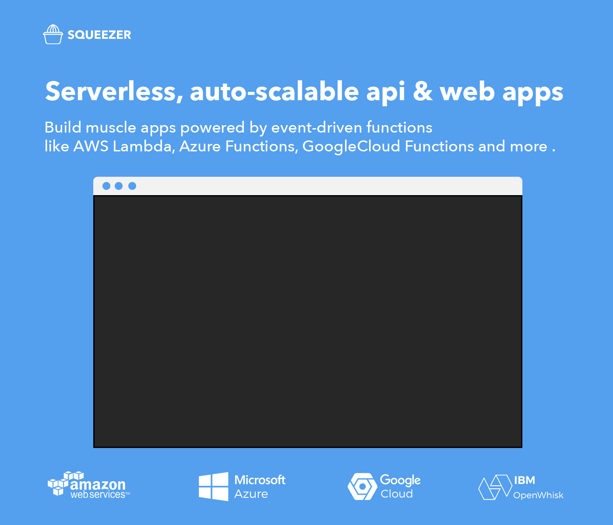

#### Framework : [squeezer.io](https://squeezer.io)
#### Docs : [docs.squeezer.io](https://docs.squeezer.io/)

### Contents

* [Getting Started](#getting-started)
* [Example Projects](#example-projects)
* [Features](#features)
* [Roadmap](#roadmap)
* [Templates](#templates)
* [Plugins](#plugins)
* [Contributing](#contributing)
* [Community](#community)
* [Meetups](#meetups)

### What is Squeezer ?

Squeezer is a platform that empowers new-entry blockchain developers to build serverless dApps simply as dead.

### ChainKit - Agnostic blockchain integration

The main usage of the ChainKit is to unify top blockchains interfaces into a single normalized API interface , therefore you can build blockchain dApps easily without digging into blockchain complex infrastructure.

[How to use the ChainKit](https://github.com/SqueezerIO/squeezer-chainkit)
### Features in short

- create blockchain wallets
- double-encrypt for wallet data
- on-the-fly encryption/decryption
- user choose how to store wallet token
- bi-directional onchain transactions (inbound and outbound)
- create blockchain payment solution
- build dApps connecting to smart contracts using chainkit agnostic connector
- deploy smart contracts
- quick intuitive code deployments by using a special mechanism which will deploy smart contracts and dApp services where code changed
- powered by microservices
- share components between functions, similar to monolytic project
- auto-deployable, auto-scalable , no DevOps requirements
- silent deployments ,no interruption for the current functionality ( really useful on production )
- one single command to simultaneously deploy all available functions on your project
where code changed from the last deployment
- automatic rollback to the previous working deployment if something goes wrong
- sequential deployments, wait for the current deployments in progress to finish
- self-healing functions
- test your code locally on a simulated functions platform for a faster development cycle
- separate your environments in multiple stages
- extend framework functionality with your own "home-made" plugins
- pay only for the usage ( no monthly subscriptions )
- [Swagger UI](http://swagger.io/) API documentation support

### Roadmap

- decentralize microservices, currently we are using cloud microservices, AWS Lambda, Azure Functions ... we need to get rid of it and store and access the microservices in a decentralized way, IPFS and Ethereum Swarm could be an option
- add 2FA and other security options when  using ChainKit `sendTransaction` which is used on withdraws, transfer and other sensitive actions
- add DEX site example using Squeezer `2way-payment-system`

#### Requirements

- [Install node.js](http://nodejs.org/) version `>=6`

### Squeezer CLI

> Squeezer command-line interface

#### Templates

Create a quick project stub by using templates :

| template | description |
|-----|--------------|
|Squeezer 2way Payment | https://github.com/SqueezerIO/squeezer-2way-payment |

#### Plugins

Extend or merge the Squeezer framework functionality with plugins

| Plugin | Author |
|-----|--------------|
|**[Serve Plugin](https://github.com/SqueezerIO/squeezer-serve)**   This plugin enables serving support for local development within the Squeezer Framework. | [Nick Chisiu](https://github.com/nickchisiu) |
|**[Swagger Plugin](https://github.com/SqueezerIO/squeezer-swagger)**   This plugin enables Swagger API Documentation support within the Squeezer Framework. | [Nick Chisiu](https://github.com/nickchisiu) |

#### Example Projects

| Project Name | Author | Demo |
|-------------|------|---------|
| **[Squeezer 2way Payment](https://github.com/SqueezerIO/squeezer-2way-payment)**    Squeezer Two Way Blockchain Payment System (inbound + outbound) | [Nick Chisiu](https://github.com/nickchisiu) | [video](https://example.org) |

#### Getting started

NOTE: **Windows** users should [enable symlinks](http://answers.perforce.com/articles/KB/3472/?q=enabling&l=en_US&fs=Search&pn=1) in order to avoid unwanted symbolic links errors .

## [Full Video tutorial](https://www.youtube.com/watch?v=2V3A_LTFu4E)

1. Install Squeezer's command line tool globally on your machine using npm:
`npm install squeezer-cli -g`
2. Create a new project using the squeezer-2way-payment template: 
`sqz create --project my-first-project --template https://github.com/SqueezerIO/squeezer-2way-payment`
3. Switch to the project's directory:
    `cd my-first-project`
4. Initialize the local directory as a Git repository:
    `git init`
5. Add the files in your new local repository. This stages them for the first commit:
    `git add .`
6. Open up GitHub in a browser, navigate to the repositories page, and click on the `New` button, and enter the name of your project that you've created locally, in our case it will be my-first-project, then create the new repository.
7. In Terminal, add the URL for the remote repository where your local repository will be pushed:
    git remote add origin remote repository URL
8. Commit the files that you've staged in your local repository:
    `git commit -m "First commit"`
9. Push the master branch to GitHub:
    `git push -u origin master`
10. Open up a new browser window and navigate to https://platform.squeezer.io, then login to the platform.
11. Click on the import project button and import the project you've created from GitHub.
12. In the first step of the import process, you have to select the repository from your list.
13. In the second step of the import, you have to choose the provider and the stage name, dev or prod.
14. After importing the project, the deployment will start automatically.
15. When the deploy will be finished, we can check the logs by clicking on it.
16. Scroll all the way down in the log window and copy the Swagger URL, then paste in a browser window.

#### Contributing

See [contributing.md](CONTRIBUTING.md) for contribution guidelines

### Community

* [Squeezer issues](https://github.com/SqueezerIO/squeezer/issues)
* [Facebook](https://www.facebook.com/Squeezer.IO/)
* [Twitter](https://twitter.com/SqueezerIO)
* [Contact Us](mailto:nick@squeezer.io)

### Meetups

* [Workshop: Serverless javascript with Squeezer](https://www.meetup.com/Cluj-Javascripters/events/243915438/?)
